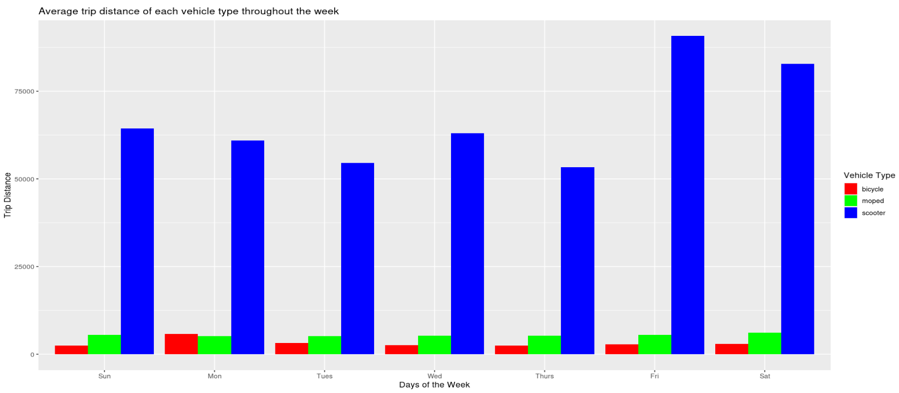
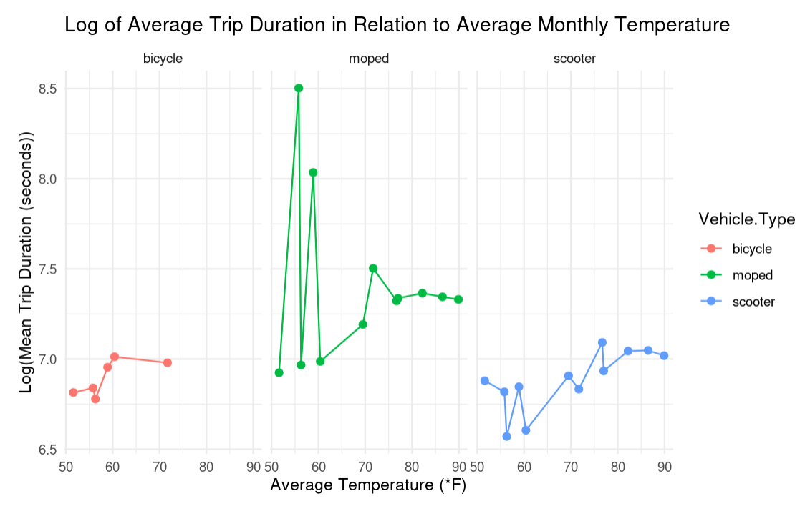
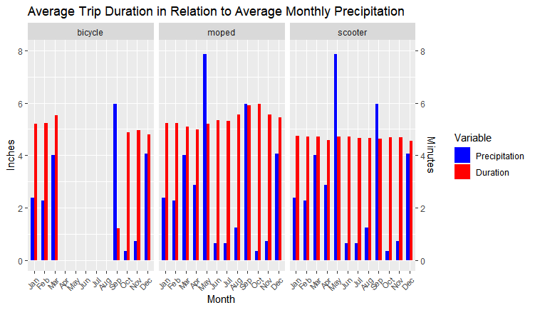
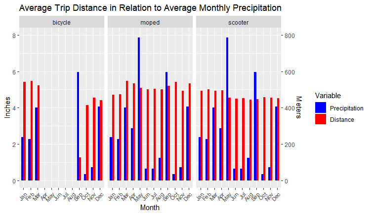

# Austin Micromobility

## Overview

### Background
This project aims to investigate the relationships and correlations between trip duration or trip distance in micro-mobility vehicles of scooters, bicycles, and mopeds, along with various factors in Austin, Texas.
The goals of this project are to identify correlations and trends between variables to help urban planners, companies such as Lime, and policymakers make better-informed decisions about micro-mobility infrastructure and services in the area. The findings from this project may also contribute to improving the usability and accessibility of micro-mobility options for people in Austin.

### Motivations
*   Urban Planning Impact: As micro-mobility vehicles begin to play a bigger role in everyday transportation. These vehicles will influence how the city will plan infrastructure projects such as dedicated bike lanes and parking spots.
*   New Transportation Policies: The continued uptick in micro-mobility vehicle usage each year can create a dilemma in the field of transportation. In other words, policymakers will need data-driven insights, such as this project, to effectively make new rules and regulations on the roadway.
*   Service Optimization for companies: As briefly mentioned in our goals, companies providing micro-mobility vehicle services such as Lime and Bird, can greatly benefit from understanding user behavior, various correlations, and common vehicle patterns. These pieces of information can allow these companies to better optimize their pricing strategies and manage their fleets.

### Data
*   The primary dataset used in our analysis is the ‘Shared Micro-mobility Vehicle Trips’ dataset provided by the city of Austin. This dataset contains individual micro-mobility trips from 2019 to 2022, totalling to 15 million rows each representing a trip. The criteria for a trip, as defined by the city of Austin, has a distance greater than 0.1 miles and less than 500 miles and has a duration that is less than 24 hours.
*   In addition to our primary Micromobility dataset, we also used Austin weather data which was provided by the National Weather Service. The weather data contained the monthly average temperature and precipitation for the year of 2019 - 2021

## Analysis
 

Plotting Average Trip Distance vs Days of the Week across 2020, it is immediately obvious that compared to bicycles and mopeds, scooter trips are much farther on average across all months and days of the week. Scooters go particularly far during the Spring (April, May), and the weekend (Friday, Saturday, to a lesser extent Sunday). Average trip distance between bicycle and moped trips are comparable; neither vehicle varies in average trip distance across month or day, excepting a slightly higher trip distance for bicycles on Mondays.

 

The bicycle trend in both graphs is not clearly apparent due to the absence of data for bicycles in high temperatures. This absence may stem from bicycles being unavailable during warmer weather. Furthermore, it could be a result of insufficient data input during days with elevated temperatures or even this specific year due to COVID-19 cases starting to rise. For the other vehicle types, mopeds and scooters, the graph is showing the moped line being a lot closer to linearity, whereas the scooter graph shows a much more sporadic line. Having said that, the relationships between average temperature and both log average trip duration and log average trip distance do not show clear correlations with one another.

 

By plotting the average monthly trip distance next to the average monthly precipitation, we can see that there is not an obvious correlation between the two variables. Similarly, there does not appear to be a correlation between average duration and precipitation either. It is noticeable, however, that mopeds tend to have slightly higher average durations and distances when compared to scooters.

## Modeling
Neural networks and random forest were used as classifiers to predict the type of vehicle based on past observations from the training set of the data. Random Forests can provide more robust and accurate predictions, handle a variety of data types, deal with noisy data, and avoid overfitting.
The accuracy and effectiveness of the chosen classifiers were evaluated by comparing its performance using recall score, precision score and a confusion matrix. Recall is the ability of a classifier to capture all the positive samples of a class.

 

Both the Random Forest and Neural Networks classifiers exhibit high accuracy in correctly identifying scooters, as evidenced by precision and recall scores close to 1. The confusion matrices for both models show a notable number of 'scooter' instances being correctly labeled as such. Imbalance in observations of vehicle types is the primary contributor to the classification inaccuracy for mopeds and bicycles
 

## Limitations
*   Initial data size was too large.
  This made it difficult for the models to find a common trend or correlation between data points and due to the smaller sample size, the accuracy of our results were naturally lower than the true values. 
*   COVID.
  Some of the problems that potentially arose from this was that some of the data for some vehicles were not as plentiful as we would have liked. Due to the potential shock of the pandemic, the reasoning behind some of our conclusions may be misplaced.
*   Potential input errors.
  Our dataset came with many outliers which required an intensive data filtration process and careful consideration of what variables we would use
